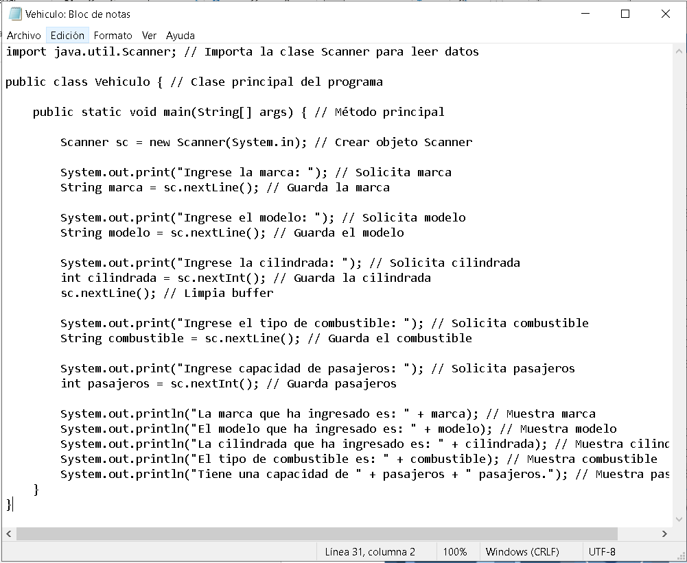
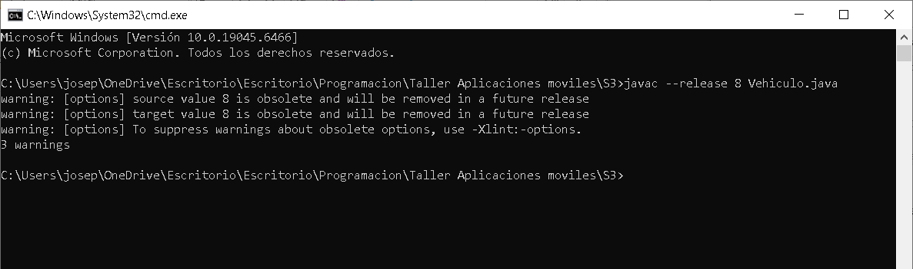
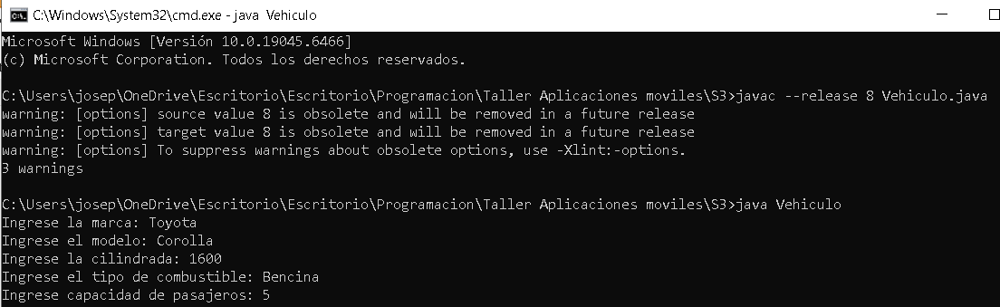
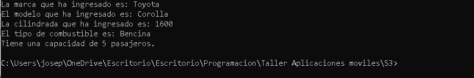

# Aplicación Java - Registro de Vehículo

Descripción
Este proyecto consiste en el desarrollo de un programa en lenguaje Java que permite ingresar datos de un vehículo mediante consola y mostrarlos en pantalla. El objetivo es comprender el proceso de compilación y ejecución sin el uso de un entorno IDE.

Este desarrollo se basa en un caso de estudio donde se requiere capturar información del usuario como parte de un sistema más complejo.

Requerimientos Funcionales
- El sistema debe permitir ingresar la marca del vehículo.
- El sistema debe permitir ingresar el modelo del vehículo.
- El sistema debe permitir ingresar la cilindrada.
- El sistema debe permitir ingresar el tipo de combustible.
- El sistema debe permitir ingresar la capacidad de pasajeros.
- El sistema debe mostrar todos los datos ingresados.

Requerimientos No Funcionales
- El sistema debe ser fácil de usar.
- El código debe ser claro y entendible.
- Debe ejecutarse en cualquier sistema con JVM.
- Debe ser compatible con versiones de Java.

Historias de Usuario
- Como usuario, quiero ingresar la marca de un vehículo para registrarlo en el sistema.
- Como usuario, quiero ingresar el modelo para identificar el vehículo.
- Como usuario, quiero ingresar la cilindrada para conocer sus características.
- Como usuario, quiero ingresar el tipo de combustible para completar la información.
- Como usuario, quiero ingresar la capacidad de pasajeros para tener un registro completo.
- Como usuario, quiero ver los datos en pantalla para verificar que fueron ingresados correctamente.

Cronograma Inicial

| Semana | Actividad |
|--------|----------|
| Semana 1 | Análisis del problema |
| Semana 2 | Desarrollo del programa |
| Semana 3 | Pruebas y ejecución |
| Semana 4 | Documentación |

Tecnologías Utilizadas
- Java
- JDK
- JVM
- GitHub

---

Evidencia de ejecución

### Código en Bloc de notas

### Compilación del programa

### Ejecución del programa

### Resultado final

